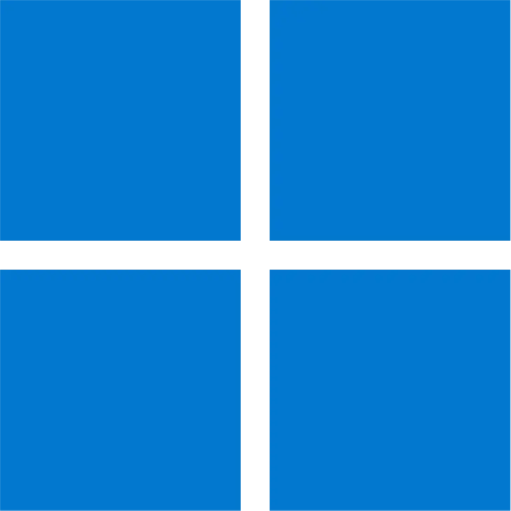

<!-- -------- Header start --------- -->

<div align = center>
  <h1 style="color:#f594a0">
    ⚙️ My-Dotfiles 🔧 
  </h1>
  <p>Space for storing my <a href="https://wiki.archlinux.org/title/Dotfiles">dotfiles</a> of DE/WM, programs & info.
     <br>&<br>
     How to use them.
  </p>
</div>

<br>

<details>
  <summary style="color:#a2e3ac">
    <small>Spaces 🗺️</small>
  </summary>

- **💻 dotfiles (current) ⇽**
- [💻 dotfiles (Plasma)][dtfls_plsma]
- [💻 dotfiles (Windows)][dtfls_win]
- [🌐 Website][wbste]
<!-- - [🗜 Home Server][hmsrvr] -->
</details>

[dtfls]:      https://github.com/soymadip/Dotfiles#%EF%B8%8F-my-dotfiles--
[dtfls_plsma]:https://github.com/soymadip/Dotfiles/tree/dotfiles-Plasma#%EF%B8%8F-my-dotfiles-plasma--
[dtfls_win]:  https://github.com/soymadip/Dotfiles/tree/dotfiles-Windows#%EF%B8%8F-my-dotfiles-plasma--
[wbste]:      https://github.com/soymadip/Dotfiles/tree/Website#%EF%B8%8F-my-website--
<!-- [hmsrvr]:     https://github.com/soymadip/Dotfiles/tree/Home-server#%EF%B8%8F-my-home-server-- -->


<!-- -------- Header End --------- -->


<h2 align="center">-----: Setup Overview :-----</h2>

```zsh
> fastfetch
```



```yaml
 soymadip@DESKTOP-SD 
 ---------------------
 OS: EndeavourOS 
 Kernel: 6.10.10-arch1-1
 Packages: 1051(pacman), 11(nix), 2 (flatpaks)
 Shell: zsh
 WM: Hyprland
 Theme: Catppuccin Macchiato [QT], Catppuccin Macchiato-lavender [GTK3/4] 
 Icons: Papirus-Dark [QT],[GTK3/4] 
 Terminal: Kitty
 Terminal Font: JetbrainsMono Nerd Font 12
 CPU: 12th Gen Intel(R) Core(TM) i5-12500H (16) @ 4.50 GHz
 GPU1: Intel(R) UHD Graphics (128.00 MiB) [Integrated]
 GPU2: NVIDIA GeForce RTX 3050 (3.87 GiB) [Discrete]
 Memory: 2.40 GiB / 15.63 GiB
```

<!-- ------------------ -->

<h2 align="center">-----: App Utilities :-----</h2>

<details>
  <summary>GUI Apps</summary>

- **  [Kitty][kty] --**                               My default *Terminal* App.
- **📟 [Wezterm][wztrm]] --**                          Gpu Accelarated *Terminal* with lua as config language.
- **📁 [Dolphin][dlphn] --**                           KDE *File Manager*.
- **📄 [Okular][oklr] --**                             KDE Document Viewer.
- **📳 [KDE Connect][kcnct] --**                       Control your PC from your Android.
- **💾 Disks --**                                      Gnome *Disk utility*.
- **󰨞  [VS Codium][code] --**                          FOSS Fork of VS Code without **telemetry**.
- **󰅲  [kate][kte] --**                                KDE IDE 
- **󰧑  [Obsidian][obsidian] --**                       "Second Brain" for Note Taking.
- **🈂️ [LibreOffice][lbrofc] --**                      Open Source Office Utility.
- **🐺 [LibreWolf][lbrolf] --**                        A custom version of Firefox, focused on privacy, security and freedom.
- **󰬡  [zen Browser][zen] --**                         web browser built on top of Firefox, focusing on faster, more secure, and beautifully customizable browsing experience. 
- **🦊 [Firefox PWA][ffpwa] --**                       Workarround for Firefox's [No PWA support][nfpwa] crap.
- **🌐 [Brave][brv] --**                               Chromium based Privacy focused Browser.
- **▶  [MPV Player][mpv] --**                          The Command line video player.
- **⏸️ [VLC  Media Player][vlc] --**                   Videolan's on-the-go video player.
- **🎵 [Spicetify][spctfy]  --**                       Customize Spotify linux client.
- **  [Kasts][ksts] --**                              Podcast Player.
- **  [64gram][64grm] --**                            Unofficial Telegram client with many customizations.
- **  [KeepassXC][kpssxc] --**                        Offline Password manager.
- **󰔎  [Kvantum][kvntm] --**                           QT & GTK svg theme engine.
- **󰍄  [NWG look][nwgl] --**                           DE independent gtk theme manager.
- **󱂩  [NWG Dock Hyprland][nwgd] --**                  DE independent Dock(Hyprland Fork).
- **󰻃  [OBS Studio][obs] --**                          FOSS software for video recording and live streaming.
- **󱓞  [rofi][rfi] --**                                Window switcher, application launcher and dmenu replacement.
- **  [WebCord][wbcrd] --**                           A Discord and SpaceBar electron based client implemented without Discord API.  
- **  [Ktorrent][ktrnt] --**                          Excellent Torrent Client.

</details>


<details>
  <summary>CLI  Apps</summary>

- **󱏘  [Paru][pru] --**                                AUR helper.
- **  [Git][gt] --**                                  The version control system.
- **  [LazyGit][lgt] --**                             Nice TUI for git.
- **  [zsh][zsh] --**                                 My login Shell
- **>  [Nu Shell][nushl] --**                          The modern Shell
- **󰡦  [yazi][yzi] --**                                Terminal file manager.
- **󱪝  [zathura][zthra] --**                           lightweight document viewer.
- **🫛 [NeoVim][nvim] --**                             [Vim][vim] with lua support.
- **🖲️ [Stow][stw] --**                                Utlity to easily symlink configs.
- **⬇️ [Yt-dlp][ytdlp]  --**                           Download video from [1000+][ytdlp_sts] websites.
- **🗄  [lsd][lsd] --**                                 Rewrite of GNU `ls` with lots of added features like colors, icons etc.
- **📊 [bottom][btm] --**                              A customizable cross-platform process monitor for terminal.
- **📊 [btop++][btp] --**                              System Monitor.
- **  [fzf][fzf] --**                                 A command-line fuzzy finder.
- **🔄 [Syncthing][sncthnc] --**                       File sync between devices.
- **  [CopyQ][cpq] --**                               Clipboard Manager.
- **  [fastfetch][fstfth] --**                        Neofetch written in C.
- **  [QT5ct][qt5ct] --**                             Qt5 Configuration Tool.
- **  [QT6ct][qt6ct] --**                             Qt6 Configuration Tool.
- **󰹑  [GrimBlast][grmblst] --**                       ScreenShot Utility.

</details>


<details> 
  <summary>Hyprland Utils</summary>

- **📦 [Hyprpicker][hprpkr] --**                       Wayland color picker that does not suck.
- **📦 [Hyprpaper][hprppr] --**                        Wallpaper utility.
- **📦 [HyprPanel][hprpnl] --**                        Community maintained Status Bar based on [ags][ags].
- **📦 [Hypridle][hpridl] --**                         Hyprland screen idle manager.
- **📦 [Hyprlock][hprlck] --**                         Hyprland's GPU-accelerated screen locking utility  

</details>


<details>
  <summary>Some useful Projects</summary>

- **📱 [Waydroid][wydrd] -**                           A container-based approach to boot a full Android system on Linux (alternative to `WSA`).
- **📱 [srccpy][scrpy] -**                             Display and control your Android device.
- **📱 [guiscrcpy][gscrpy] -**                         Open Source GUI based Android Screen Mirroring System.
- **🔤 [NerdFont][nf] -**                              Beautiful Font with icon support.

</details>

<br>
<!-- -------------------------- -->

<h2 align="center">-----: Keyboard Shorttcuts :-----</h2>

> Some of below are not imlemented yet (in Misc section).

### General Window functions:-

| Keys | Action |
| :--- | :--- |
| <kbd>Super</kbd> + <kbd>Q</kbd><br><kbd>Alt</kbd> + <kbd>F4</kbd> | Close focused window|
| <kbd>Super</kbd> + <kbd>F</kbd>   | Toggle the window between focus and float |
| <kbd>Alt</kbd> + <kbd>Enter</kbd> | Toggle the window between focus and fullscreen |
| <kbd>Super</kbd> + <kbd>G</kbd>   | Toggle the window between focus and group |
| <kbd>Super</kbd> + <kbd>Shift</kbd> + <kbd>F</kbd> | Toggle pin on focused window |

### Shift Window focus:-

| Keys | Action |
| :--- | :--- |
| <kbd>Super</kbd> + <kbd>J</kbd> | Move focus to __below/next__ window|
| <kbd>Super</kbd> + <kbd>K</kbd> | Move focus to __above__ window|
| <kbd>Super</kbd> + <kbd>H</kbd> | Move focus to __left__ window|
| <kbd>Super</kbd> + <kbd>L</kbd> | Move focus to __right__ window|


### Move windows:- 

| Keys | Action |
| :--- | :--- |
| <kbd>Super</kbd> +  <kbd>shift</kbd> + <kbd>J</kbd> | Move window to __below__ |
| <kbd>Super</kbd> +  <kbd>shift</kbd> + <kbd>K</kbd> | Move window to __above__ |
| <kbd>Super</kbd> +  <kbd>shift</kbd> + <kbd>H</kbd> | Move window to __left__|
| <kbd>Super</kbd> +  <kbd>shift</kbd> + <kbd>L</kbd> | Move window to __right__ |
| <kbd>Super</kbd> + <kbd>[0-9]</kbd> | Move window to __[0-9]__ workspace|
| <kbd>Super</kbd>  +  <kbd>shift</kbd> + <kbd>S</kbd> | Move window to __Special Workspace (scratchpad)__|


### Change Window Size:-

| Keys | Action |
| :--- | :--- |
| <kbd>Super</kbd> +  <kbd>alt</kbd> + <kbd>J</kbd> | Increase size of __bottom__  side|
| <kbd>Super</kbd> +  <kbd>alt</kbd> + <kbd>K</kbd> | Increase size of __top__ side|
| <kbd>Super</kbd> +  <kbd>alt</kbd> + <kbd>H</kbd> | Increase size of __left__  side|
| <kbd>Super</kbd> +  <kbd>alt</kbd> + <kbd>L</kbd> | Increase size of __right__  side|


### Change Window Size:-

| Keys | Action |
| :--- | :--- |
| <kbd>Super</kbd> + <kbd>tab</kbd> | Switch to last used workspace |
| <kbd>Super</kbd> + <kbd>[0-9]</kbd> | Switch workspace to relative number |
| <kbd>Super</kbd> + <kbd>S</kbd> | Toggle to special workspace |


### Misc:-

| Keys | Action |
| :--- | :--- |
| <kbd>Super</kbd> + <kbd>Del</kbd> | Kill Hyprland session |
| <kbd>Super</kbd> + <kbd>W</kbd> | Launch web browser (firefox) |
| <kbd>Super</kbd> + <kbd>slash</kbd> | Launch keybinds hint |
| <kbd>Super</kbd> + <kbd>L</kbd> | Launch lock screen |
| <kbd>Super</kbd> + <kbd>Backspace</kbd> | Launch logout menu |
| <kbd>Super</kbd> + <kbd>M</kbd> | Launch terminal emulator (kitty) |
| <kbd>Super</kbd> + <kbd>E</kbd> | Launch file manager (dolphin) |
| <kbd>Super</kbd> + <kbd>C</kbd> | Launch text editor (vscode) |
| <kbd>Ctrl</kbd> + <kbd>Shift</kbd> + <kbd>Esc</kbd> | Launch system monitor (htop/btop or fallback to top) |
| <kbd>Super</kbd> + <kbd>A</kbd> | Launch application launcher (rofi) |
| <kbd>Super</kbd> + <kbd>Tab</kbd> | Launch window switcher (rofi) |
| <kbd>Super</kbd> + <kbd>Shift</kbd> + <kbd>E</kbd> | Launch file explorer (rofi) |
| <kbd>F10</kbd> | Toggle audio mute |
| <kbd>F11</kbd> | Decrease volume |
| <kbd>F12</kbd> | Increase volume |
| <kbd>Super</kbd> + <kbd>P</kbd> | Partial screenshot capture |
| <kbd>Super</kbd> + <kbd>Ctrl</kbd> + <kbd>P</kbd> | Partial screenshot capture (frozen screen) |
| <kbd>Super</kbd> + <kbd>Alt</kbd> + <kbd>P</kbd> | Monitor screenshot capture |
| <kbd>PrtScn</kbd> | All monitors screenshot capture |
| <kbd>Super</kbd> + <kbd>Alt</kbd> + <kbd>G</kbd> | Disable hypr effects for gamemode |
| <kbd>Super</kbd> + <kbd>Alt</kbd> + <kbd>→</kbd><kbd>←</kbd> | Cycle wallpaper |
| <kbd>Super</kbd> + <kbd>Alt</kbd> + <kbd>↑</kbd><kbd>↓</kbd> | Cycle waybar mode |
| <kbd>Super</kbd> + <kbd>Shift</kbd> + <kbd>R</kbd> | Launch wallbash mode select menu (rofi) |
| <kbd>Super</kbd> + <kbd>Shift</kbd> + <kbd>T</kbd> | Launch theme select menu (rofi) |
| <kbd>Super</kbd> + <kbd>Shift</kbd> + <kbd>A</kbd> | Launch style select menu (rofi) |
| <kbd>Super</kbd> + <kbd>Shift</kbd> + <kbd>W</kbd> | Launch wallpaper select menu (rofi) |
| <kbd>Super</kbd> + <kbd>V</kbd> | Launch clipboard (rofi) |
| <kbd>Super</kbd> + <kbd>K</kbd> | Switch keyboard layout |
| <kbd>Super</kbd> + <kbd>←</kbd><kbd>→</kbd><kbd>↑</kbd><kbd>↓</kbd> | |
| <kbd>Alt</kbd> + <kbd>Tab</kbd> |  |
| <kbd>Super</kbd> + <kbd>Ctrl</kbd> + <kbd>←</kbd><kbd>→</kbd> | Switch workspaces to a relative workspace |
| <kbd>Super</kbd> + <kbd>Ctrl</kbd> + <kbd>↓</kbd> | Move to the first empty workspace |
| <kbd>Super</kbd> + <kbd>Shift</kbd> + <kbd>←</kbd><kbd>→</kbd><kbd>↑</kbd><kbd>↓</kbd> | Resize windows |
| <kbd>Super</kbd> + <kbd>Shift</kbd> + <kbd>Ctrl</kbd> + <kbd>←</kbd><kbd>→</kbd><kbd>↑</kbd><kbd>↓</kbd> | Move focused window (tiled/floating) around the current workspace |
| <kbd>Super</kbd> + <kbd>MouseScroll</kbd> | Scroll through existing workspaces |
| <kbd>Super</kbd> + <kbd>LeftClick</kbd><br><kbd>Super</kbd> + <kbd>Z</kbd> | Move focused window |
| <kbd>Super</kbd> + <kbd>RightClick</kbd><br><kbd>Super</kbd> + <kbd>X</kbd> | Resize focused window |
| <kbd>Super</kbd> + <kbd>J</kbd> | Toggle focused window split |
| <kbd>Super</kbd> + <kbd>Alt</kbd> + <kbd>[0-9]</kbd> | Move focused window to a workspace silently |
| <kbd>Super</kbd> + <kbd>Ctrl</kbd> + <kbd>H</kbd> | Move between grouped windows backward |
| <kbd>Super</kbd> + <kbd>Ctrl</kbd> + <kbd>L</kbd> | Move between grouped windows forward |


</br></br>

<h2 align="center">-----: ⚠️ :-----</h2>

<p align="center"> 
  I just recently started using Hyprland, WM in general, so my dotfiles are reguraly being updated as i learn new things 
  & add them to make setup as close as possible to complete DE. 
  <br>
  Also install script is not yet ready, I am working on it's backend <a href="https://github.com/soymadip/KireiSakura-Kit">library</a> which is close to being workable.
</p>


</br></br>

<!-- ___________________LINKS___________________ -->

[ags]:        .config/ags
[64grm]:      .local/share/64Gram/
[btm]:        .config/bottom
[brv]:        .config/BraveSoftware/Brave-Browser/
[btp]:        .config/btop
[code]:       .config/Code/
[cpq]:        .config/copyq/
[dlphn]:      .config/dolphinrc
[fstfth]:     .config/fastfetch
[ffpwa]:      .local/share/firefox\PWA
[fzf]:        https://github.com/junegunn/fzf
[grmblst]:    https://github.com/hyprwm/contrib/blob/main/grimblast
[gscrpy]:     https://github.com/srevinsaju/guiscrcpy
[gt]:         .config/git
[hprpkr]:     .config/hypr/hyprpicker.conf
[hprppr]:     .config/hypr/hyprpaper.conf
[hprpnl]:     .config/ags
[hpridl]:     .config/hypr/hypridle.conf
[hprlck]:     .config/hypr/hyprlock.conf
[lgt]:        .config/lazygit
[kte]:        .config/katerc
[ksts]:       .local/share/kasts
[kcnct]:      https://kdeconnect.kde.org/
[kty]:        .config/kitty/
[ktrnt]:      .config/ktorrentrc
[kpssxc]:     .config/keepassxc/
[kvntm]:      .config/Kvantum/
[lbrolf]:     .librewolf
[lbrofc]:     .config/libreoffice/4/user
[lsd]:        .config/lsd
[mpv]:        .config/mpv/
[nf]:         https://www.nerdfonts.com/
[nfpwa]:      https://9to5google.com/2021/01/27/firefox-discontinues-work-pwa-desktop/
[nvim]:       .config/nvim/
[nushl]:      .config/nushell
[nwgl]:       .config/nwg-look/
[nwgd]:       .config/nwg-dock-hyprland/
[obsidian]:   https://obsidian.md
[obs]:        .config/obs-studio/
[oklr]:       .config/okularrc
[pru]:        .config/paru
[qt5ct]:      .config/qt5ct/
[qt6ct]:      .config/qt6ct/
[scrpy]:      https://github.com/Genymobile/scrcpy
[rfi]:        .config/rofi/
[sncthnc]:    https://syncthing.net/
[spctfy]:     .config/Spicetify/
[stw]:        https://www.gnu.org/software/stow/manual/stow.html
[vim]:        https://en.wikipedia.org/wiki/Vim_(text_editor)
[vlc]:        .config/vlc/
[wbcrd]:      .config/WebCord/
[wydrd]:      https://waydro.id/
[wztrm]:      .config/wezterm
[ytdlp]:      https://github.com/yt-dlp/yt-dlp
[ytdlp_sts]:  https://github.com/yt-dlp/yt-dlp/blob/master/supportedsites.md
[yzi]:        .config/yazi/
[zen]:        .zen/
[zsh]:        .congig/zsh
[zthra]:      .config/zathura/zathurarc